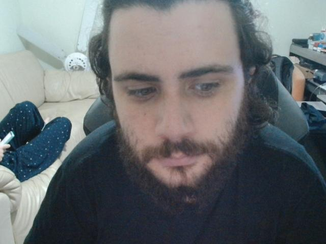
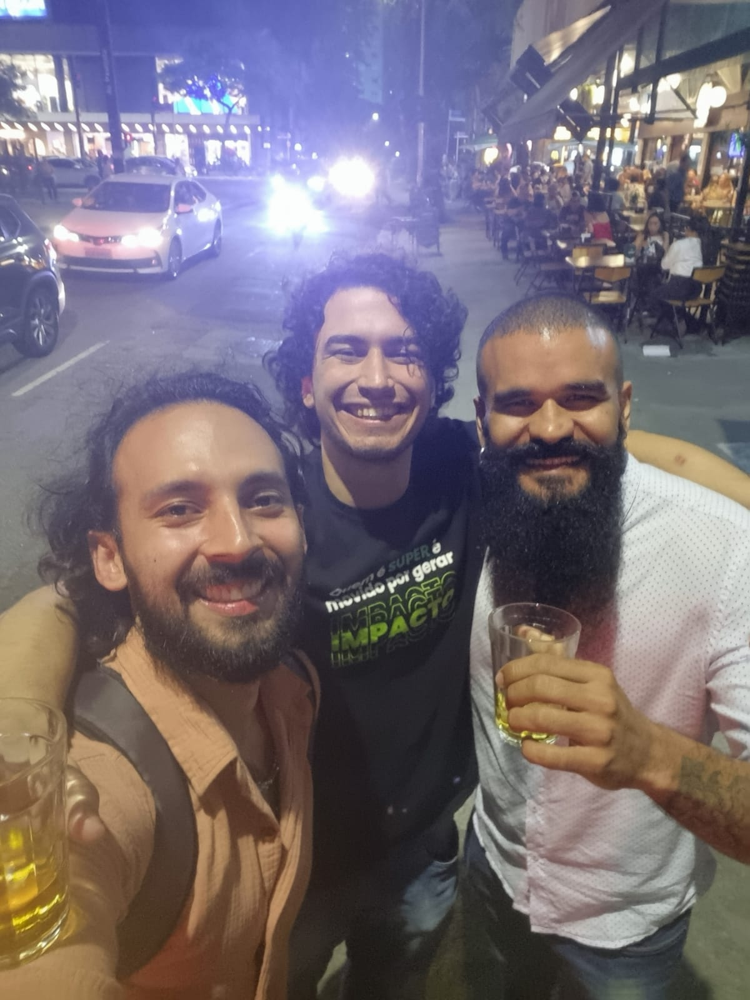

# Disciplina: Computer Vision

- [Disciplina: Computer Vision](#disciplina-computer-vision)
  - [Professor: Felipe Meganha ](#professor-felipe-meganha-)
  - [Conteúdo da Disciplina](#conteúdo-da-disciplina)
- [Cases Desenvolvidos](#cases-desenvolvidos)
  - [Case: Projeto Integrado - Quantum Finance](#case-projeto-integrado---quantum-finance)
    - [Descricao do Case:](#descricao-do-case)
    - [Integrantes da Equipe](#integrantes-da-equipe)
    - [Ferramentas e Tecnologias Utilizadas](#ferramentas-e-tecnologias-utilizadas)
    - [Entregas Realizadas](#entregas-realizadas)

## Professor: Felipe Meganha 

## Conteúdo da Disciplina
1. Manipulação de imagens
2. Segmentação de imagens
3. Realidade aumentada
4. Generative AI API's

# Cases Desenvolvidos
## Case: Projeto Integrado - Quantum Finance
### Descricao do Case:
O setor de fraudes apontou que existem clientes que se queixaram de não contratar serviços específicos, como o crédito pessoal. No entanto, os protocolos de segurança da senha foram realizados em conformidade, cada cliente autenticou com sua própria senha.​ Em função disso, o banco precisa arcar com reembolsos e medidas de contenção para evitar processos judiciais, pois os clientes alegam terem sido invadidos por hackers ou algo similar.​

Além da senha, podemos implementar formas de autenticação complementares, a depender do serviço, que utilizasse uma verificação e identificação facial. Caso o cliente não seja autenticado, ele será atendido por uma esteira dedicada e as evidências da não identificação serão encaminhadas para a área de IA para validação dos parâmetros e limiares para aperfeiçoamento do modelo.

Será necessário construir:​

Detector de faces​
Identificação de faces​
Detecção de vivacidade (liveness) para evitar que um fraudador utilize uma foto estática.

### Integrantes da Equipe
1. Fabio Souza 
2. Felipe Scudeller 
3. Victor Galvão 

### Ferramentas e Tecnologias Utilizadas
1. **Python **
   - Python é uma linguagem de programação de alto nível, interpretada e de propósito geral, amplamente utilizada em ciência de dados, desenvolvimento web, automação, entre outros.
   - É conhecida por sua sintaxe simples e legibilidade, tornando-a ideal para iniciantes e profissionais.
   - Possui uma vasta biblioteca padrão e uma grande variedade de pacotes de terceiros para diferentes fins.

2. **Google Colab **
   - Google Colab é um ambiente de notebook baseado em nuvem oferecido gratuitamente pelo Google.
   - Permite criar e executar notebooks Jupyter diretamente no navegador, sem a necessidade de configuração local.
   - Oferece suporte para execução de código Python, visualização de dados, integração com bibliotecas populares e colaboração em tempo real.

3. **OpenCV (cv2) **
   - OpenCV (Open Source Computer Vision Library) é uma biblioteca de código aberto voltada para visão computacional e processamento de imagens.
   - Oferece uma vasta gama de funcionalidades para manipulação de imagens, detecção de objetos, reconhecimento de padrões, entre outros.
   - É amplamente utilizado em aplicações como reconhecimento facial, veículos autônomos, realidade aumentada, entre outros.

4. **PIL (Pillow) **
   - PIL (Python Imaging Library) é uma biblioteca de processamento de imagem em Python.
   - Permite abrir, manipular e salvar uma ampla variedade de formatos de imagem.
   - É útil para tarefas de processamento de imagem básicas, como redimensionamento, recorte, rotação, entre outros.

5. **IPython.display**
   - IPython.display é um módulo que oferece recursos para exibir conteúdo rico em notebooks Jupyter.
   - Permite exibir objetos HTML, áudio, vídeo, imagens e outros tipos de mídia diretamente nos notebooks.
   - Facilita a criação de documentos interativos e visuais.

6. **time **
   - O módulo time é uma parte padrão da biblioteca padrão do Python que fornece funcionalidades relacionadas ao gerenciamento de tempo.
   - Permite medir o tempo de execução de operações, criar pausas, agendar tarefas, entre outros.
   - É útil para operações que envolvem sincronização, temporização e controle de fluxo.

### Entregas Realizadas
1. `photo.jpg` - Foto usada para treino do modelo

2. `photo2.jpg` - Foto usada para treino do modelo

3. `photo3.jpg` - Foto usada para treino do modelo

4. `READ_ME.txt` - Arquivo texto com instruções da entrega
5. `visao_computacional.ipynb` - Jupyter notebook com a solução dos problemas propostas