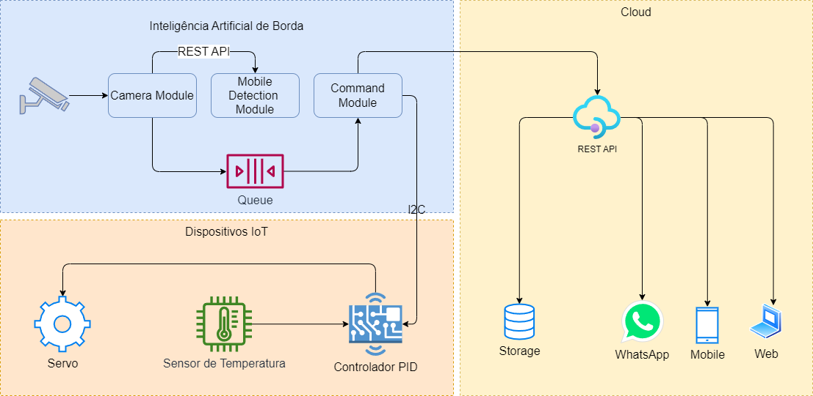

# Disciplina: Robotics and IOT

- [Disciplina: Robotics and IOT](#disciplina-robotics-and-iot)
  - [Professor: Gleisson S. Bezerra ](#professor-gleisson-s-bezerra-)
  - [Conteúdo da Disciplina](#conteúdo-da-disciplina)
- [Cases Desenvolvidos](#cases-desenvolvidos)
  - [Case: Projeto Integrado - Quantum Finance](#case-projeto-integrado---quantum-finance)
    - [Descricao do Case:](#descricao-do-case)
    - [Integrantes da Equipe](#integrantes-da-equipe)
    - [Entregas Realizadas](#entregas-realizadas)

## Professor: Gleisson S. Bezerra 

## Conteúdo da Disciplina
1. Dispositivos e Aplicações
2. Nuvem e Conectividade
3. Visão Computacional
4. Desenvolvimento Projeto Final

# Cases Desenvolvidos
## Case: Projeto Integrado - Quantum Finance
### Descricao do Case:
Assista o vídeo da demo para ver o resultado final do projeto que fizemos em sala: https://www.youtube.com/watch?v=rxJCkBenWIA

Observe que saída do console se refere ao Command Module e com isso é possível verificar o log de temperatura e humidade que está sendo obtido do Arduino e enviado para o Blynk. Assim como também a confirmação de alerta de pessoa presente na área de risco.

- Utilizar o resultado do projeto final da última aula feito em grupo e incluir o desenho técnico final;
- Deve-se também fazer referência aos recursos de nuvem e de borda que foram mostrados em aula;
- Não é necessário fazer a implementação de nenhum código;
- Escrever um relatório de 2 páginas explicando a arquitetura e o comportamento esperado de cada parte;
- Não esqueça de comentar como todos os requisites foram atendidos e de responder aos questionamentos do cliente.

Boa sorte!

### Integrantes da Equipe
1. Fabio Souza 

### Entregas Realizadas
1. `arquitetura.drawio` - Drawio com o desenho da arquitetura
2. `arquitetura.png` - Arquitetura proposta

3. `Relatorio Final.pdf` - Relatório com a exmplicação da arquitetura e comportamento esperado